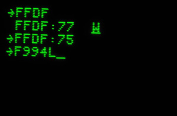
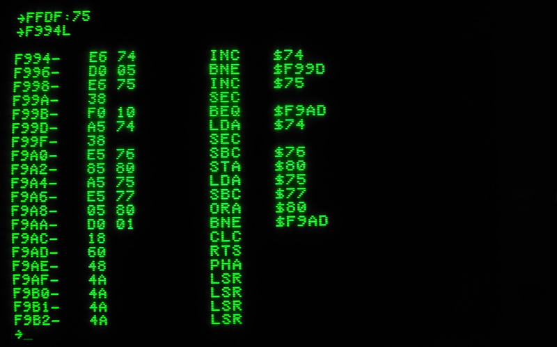

# Apple III Custom ROM Project (B9 ROM)
This project builds custom ROMs for the Apple /// - for the main system ROM (the ROM in position "**B9**").

Currently, ROMs with the following functionality are available:

  * A custom ROM supporting bootstrapping volumes directly from the [DAN II Controller](https://github.com/ThorstenBr/Apple2Card) card. No more floppy disks required.

  * A custom ROM extended the Apple /// debug monitor - adding a disassembler.

    The Apple /// ROM inherited many routines from the Apple II, however, the disassembler had to be stripped, since Apple only installed a tiny 4KB ROM in the Apple ///.
    The machine does support 8KB ROMs though.
    So, by installing a larger ROM, we have the necessary space to copy missing disassembler routine from the Apple II and add it to the Apple /// ROM.

## Custom ROM Adapter
If you need an adapter to plug a standard (E)EPROM on to the Apple /// mainboard, here's my PCB design which fits into the tight space of the Apple ///:

[https://github.com/ThorstenBr/Apple_III_ROM_Adapter](https://github.com/ThorstenBr/Apple_III_ROM_Adapter).

## Available ROMs
The [/bin](bin) folder contains the following ROM variants for the Apple ///:

* [**A3ROM_ORIGINAL_4KB.bin**](bin/A3ROM_ORIGINAL_4KB.bin)

    Original 4KB ROM for the Apple ///. In case you just want to replace a defective ROM with an original.

* [**A3ROM_ORIGINAL_EXTMONITOR_8KB.bin**](bin/A3ROM_ORIGINAL_EXTMONITOR_8KB.bin)

    8KB ROM which contains the original (unmodified) Apple /// ROM in the default ROM bank (bank 1).
    The alternate ROM bank 0 contains an adapted ROM variant with improved "debug monitor" (see below).

* [**A3ROM_DANII_4KB.bin**](bin/A3ROM_DANII_4KB.bin)

    Custom 4KB Apple /// ROM variant. Adapted to support direct bootstrapping of volumes from the [DAN II Controller](https://github.com/ThorstenBr/Apple2Card) card.

* [**A3ROM_DANII_EXTMONITOR_8KB.bin**](bin/A3ROM_DANII_EXTMONITOR_8KB.bin)

    Custom 8KB Apple /// ROM variant. Default ROM bank 1 contains the adapted ROM to support direct bootstrapping of volumes from the [DAN II Controller](https://github.com/ThorstenBr/Apple2Card) card.
    The alternate ROM bank 0 contains an adapted ROM variant with improved "debug monitor" (see below).

## Using the Custom ROM Bank
The Apple /// has two ROM banks, each is 4KB. Apple /// were orignally only shipped with a 4KB ROM, which is mapped to ROM bank 1.
ROM bank 0 could be activated, but was empty (would show random data).

The ROM banks are switched through the Apple ///'s "system environment register" at **$FFDF, bit 1** (value of 0x2). When you installed one of the 8KB ROM variants, you can activate the alternate ROM bank when using the monitor:

* Press "**OpenApple-Ctrl-RESET**" to enter the debug monitor (then release RESET, but keep the OpenApple-key pressed for a moment).

* Enter "**FFDF:75**" to enable **alternate ROM bank 0** (clears bit 1 = value 0x02).

    

* Now the alternate ROM is active. If you programmed a ROM variant with extended debug monitor, e.g. you can now use the monitor command "**L**" for a debug **l**isting:

    

* Enter "**FFDF:77**" to switch to **default ROM bank 1** again (stock ROM, no extended debug monitor).

## Using the Extended Apple /// Monitor

The debug monitor in the Apple /// ROM is very similar to the Apple ][. It was implemented based on the same code base. However, due to the limited space of the Apple ///'s 4KB ROM, a number of options were removed.
The bank 0 ROM "extended Apple /// Debug Monitor" (see above) uses the normally unused second Apple /// ROM bank to add some of missing Apple ][ monitor options back to the Apple ///. The following commands/options are added:

* **L** command to trigger a disassembler **l**isting.

    *Example: Trigger a disassembler listing starting at address $300.*

         300L

* **&lt;CTRL-E&gt;+RETURN** to print register values (A, X, Y, Processor status flags, Stack).

* **:** command edits register values, when called immediately after a &lt;CTRL-E&gt;+RETURN command.

     *Example: Show all register values, then set registers A,X,Y to values 11, 22 and 33 respectively.*

         ->(CTRL-E)+(RETURN)
         A=FF X=00 Y=00 P=00 S=FF
         ->:11 22 33
         ->(CTRL-E)+(RETURN)
         A=11 X=22 Y=33 P=00 S=FF

* **J** jumps to the given address, *after* restoring the registers. The **J** command is also supported by the default Apple /// ROM, however, the default ROM does not restore registers (no debugging/stepping was supported, so it did not make sense for the original ROM to save/restore registers).
The extended debug monitor restores this feature, exactly as it was supported on the Apple ][.

* The **BRK** instruction is caught by the debug monitor in the extended monitor (just as on the Apple ][). The monitor also saves registers when entering the monitor via a BRK instruction.
